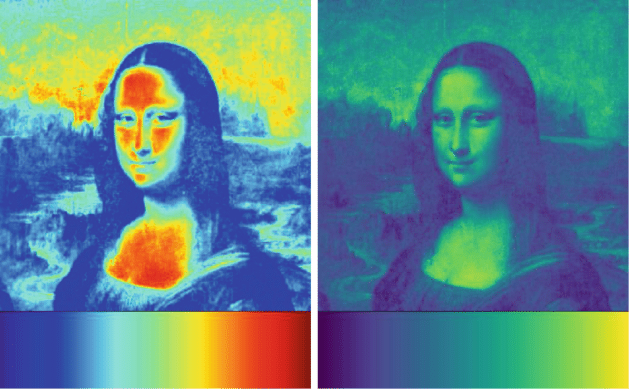
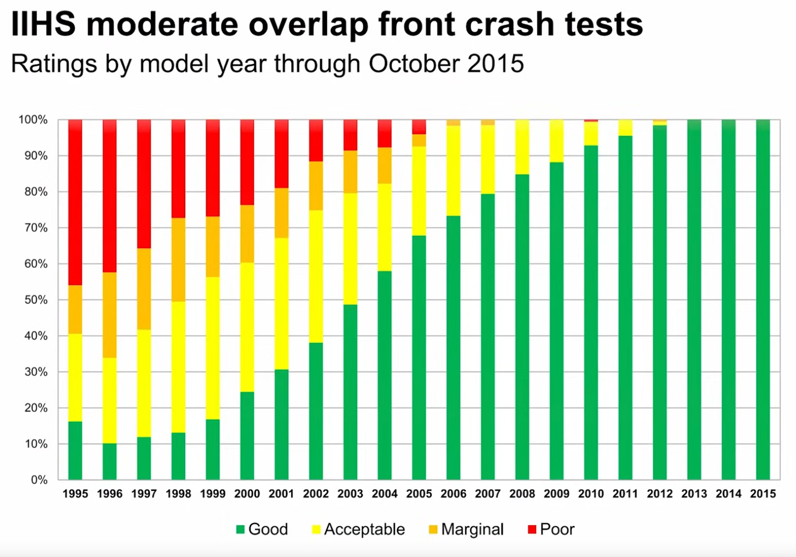
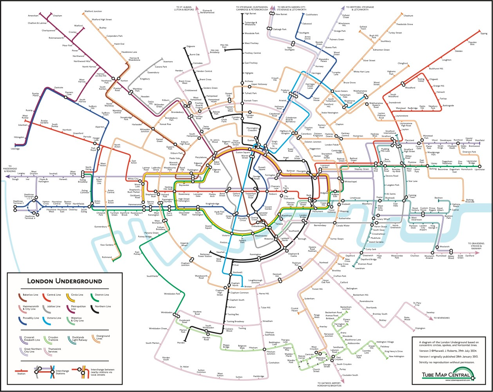

```{r setup, include=FALSE}
knitr::opts_chunk$set(echo = FALSE,
                      warning = FALSE,
                      message = FALSE,
                      comment = NA)
## Plotting
library(ggplot2) # graphics
library(treemapify) # tree map
library(patchwork) # arrange plots
library(mapview) # Leaflet plugin
library(gridExtra)
library(grid)

## Data
library(rnaturalearthdata) # earth shape files
library(HistData) # nightingale data

## Colour
library(viridis) # colour maps
library(RColorBrewer)
library(colorspace)

## Tools
library(dplyr)
library(tidyr)
library(sf)


my_theme <- theme_minimal() +
  theme(
    panel.grid = element_blank()
  )

theme_set(my_theme)
```

## Themes

In no particular order...

-   A language of data
-   A language of graphics
-   Good graphic design principles
-   The context of graphics

## [Data Literacy Competencies](https://www.statcan.gc.ca/en/wtc/data-literacy/compentencies)

> The knowledge and skills you need to effectively work with data.

<cite>Statistics Canada. (2020-09-23). https://www.statcan.gc.ca/en/wtc/data-literacy/compentencies</cite>

# What Makes Data Visualization Fun?

# Defining Data

## What is (are) Research Data?

> \[R\]esearch data represent any material derived from a source of potential information, both measurable and abstract, **gathered for analysis** or as part of developing findings or insights on a subject.

<cite>Unpublished RDM manuscript.</cite>

## What are Possible Sources of Data?

people, films, photographs, recordings, artifacts, specimens, music score sheets, art, an existing data set...

# Classifying Data

## Scales (Math)

* Nominal (No Order)
* Ordinal (Rank Odering)
* Interval (Arbitrary Zero, Quantifiable Difference)
* Ratio (Proportional)

<cite>Stevens, S. (1946). On the theory of scales of Measurement. Science. 103 (2684)</cite>

## Collection Method

* Counted (Discrete, Observerd)
* Measured (Continuous)
* Set (Parameter, Categorical)
* Reported (Survey, Nominal, Ordinal, Free Text)

<!-- ## Computational Representations -->

<!-- * Numeric (integers, rationals) -->
<!-- * Character (strings) -->
<!-- * Boolean (true, false)... -->

<!-- ## Attributes -->

<!-- * Dates -->
<!-- * Currencies -->
<!-- * Coordinates -->
<!-- * ... -->

# Visualizing Data

## What is Data Visualization?

:::{.incremental}
* The **abstraction** of data, using shapes, colour, and position. Also called easthetic attributes.
* These are displayed on a medium, and that medium in turn has context. This context is both audience and place specific.
:::

# Mapping Shape & Colour

------------------------------------------------------------------------

```{r}
votes <- read.csv("data/elections_2020.csv")

ggplot(data = votes, aes(area = electoral.votes, fill = candidate, label = state.name)) +
  geom_treemap() +
  scale_fill_manual(values = c("#FF8F3F", "#FF3F8F")) +
  theme(
    legend.position = "none"
  )
```

------------------------------------------------------------------------

```{r}
#| fig-width: 5

cont_united_states <- rnaturalearth::ne_states(iso_a2 = "US") |>
  filter(name != "Hawaii" & name != "Alaska")

cont_united_states <- sp::merge(cont_united_states, votes, by.x = "name", by.y = "state.name")

alaska <- rnaturalearth::ne_states(iso_a2 = "US") |>
  filter(name == "Alaska")

hawaii <- rnaturalearth::ne_states(iso_a2 = "US") |>
  filter(name == "Hawaii")

us_plot <- ggplot(data = cont_united_states, aes(fill = candidate)) +
  geom_sf() +
  coord_sf(crs = st_crs(3347)) +
  scale_fill_manual(values = c("#045bcd", "#f8323c")) +
  theme(
    axis.text = element_blank(),
    legend.position = "none"
  )

al_plot <- ggplot(data = alaska) +
  geom_sf(fill = "#f8323c") +
  coord_sf(crs = st_crs(3347)) +
  theme(
    axis.text = element_blank()
  )

h_plot <- ggplot(data = hawaii) +
  geom_sf(fill = "#045bcd") +
  coord_sf(crs = st_crs(3347)) +
  theme(
    axis.text = element_blank()
  )

layout <- c(
  area(1, 8, 15, 18),
  area(10, 1, 14, 2),
  area(8, 1, 20, 20))

al_plot + h_plot + us_plot + plot_layout(design = layout,
                                         widths = 20)
```

------------------------------------------------------------------------


<cite>Source: https://static01.nyt.com/images/2020/11/20/learning/2020electoralvotesmapLN/2020electoralvotesmapLN-superJumbo.png?quality=75&auto=webp]</cite>

# A Note on Colour & Scale

------------------------------------------------------------------------

```{r}
df <- data.frame(x = c(1:9),
                 y = seq(1, 27, by = 3))

df_c <- data.frame(a = c(1:100))

df_d <- data.frame(a = runif(1000, -500, 500))
df_d$a <- sort(df_d$a)

margin_theme <- theme(
  plot.title = element_text(margin = margin(b = 5)),
  #plot.margin = margin(.5, "cm"),
  legend.position = "none",
  axis.text = element_blank()
)

a <- ggplot(data = df_c, aes(x = 1, y = a, fill = a)) +
  geom_col() +
  scale_fill_viridis(option = "D") +
  coord_flip() +
  labs(x = "", y = "") +
  margin_theme

rainbow_map <- ggplot(data = df_c, aes(x = 1, y = a, fill = a)) +
  geom_col() +
  #scale_fill_gradientn(colors = c("red", "orange", "yellow", "green", "blue", "#560591", "violet", "deeppink"))+
  scale_fill_gradientn(colours = rev(rainbow(n=10))) +
  # scale_fill_viridis(option = "D") +
  coord_flip() +
  labs(x = "", y = "") +
  margin_theme

b <- ggplot(df, aes(x = y, color = as.factor(x), y = 1)) +
  geom_point(size = 25) +
  ylim(.975, 1.025) +
  labs(x = "", y = "") +
  scale_color_brewer(palette = "Blues") +
  margin_theme

c <- ggplot(df, aes(x = y, color = as.factor(x), y = 1)) +
  geom_point(size = 25) +
  ylim(.975, 1.025) +
  labs(x = "", y = "") +
  scale_color_brewer(palette = "BrBG") +
  margin_theme

d <- ggplot(data = df_d, aes(x = a, y = 1, fill = a)) +
  geom_col(width = 10) +
  scale_fill_continuous_diverging(palette = "Green-Brown", rev = TRUE) +
  labs(x = "", y = "") +
  margin_theme

e <- ggplot(df, aes(x = y, color = as.factor(x), y = 1)) +
  geom_point(size = 25) +
  ylim(.975, 1.025) +
  labs(x = "", y = "") +
  scale_color_brewer(palette = "Set1") +
  margin_theme
```

* **Nominal or Categorical, ie No Order**

```{r}
e
```

------------------------------------------------------------------------

* Nominal or Categorical, ie No Order
* **Ordinal -- Discrete or Integer, ie Rank Odering**

```{r}
b
```

------------------------------------------------------------------------

* Nominal aka Categorical, ie No Order
* Ordinal -- Discrete aka Integer, ie Rank Odering
* **Interval -- Discrete or Continuous, ie Arbitrary Zero & Quantifiable Difference**

```{r}
#| fig-height: 3
c/d
```

------------------------------------------------------------------------

* Nominal aka Categorical, ie No Order
* Ordinal -- Discrete aka Integer, ie Rank Odering
* Interval -- Discrete or Continuous, ie Arbitrary Zero & Quantifiable Difference
* **Ratio -- Continuous, ie Proportional**

```{r}
#| fig-height: 3
a
```

# Where Colour Can Have a Significant Impact

------------------------------------------------------------------------

* **Medium of Display** - Journal, Poster, Digital Display, Black & White vs Colour...

::: {.incremental}
* **Viewer Limitations** - Colour Blindness
* **Cultural Interpretation or Norms** - Colour has meaning
* **Interpretting the Data** - Accurate mapping
:::

------------------------------------------------------------------------

> We show statistically significant results demonstrating that our 2D visualizations are more accurate and efficient than 3D representations, **and that a perceptually appropriate color map leads to fewer diagnostic mistakes than a rainbow color map.**

<cite>Borkin, M., Gajos, K., Peters, A., Mitsouras, D., Melchionna, S., Rybicki, F., ... & Pfister, H. (2011). Evaluation of artery visualizations for heart disease diagnosis. IEEE transactions on visualization and computer graphics, 17(12), 2479-2488.</cite>

------------------------------------------------------------------------

```{r}
#| fig-height: 3

a
cat(df_c$a)
rainbow_map
```

------------------------------------------------------------------------

:::: {.columns}

::: {.column .mona-lisa width="40%"}

```{r}
df_ml <- matrix(sample(10:64, 270, replace = TRUE), ncol = 10)
cat(df_ml)
```

:::

::: {.column width="60%"}
<p><a href="https://commons.wikimedia.org/wiki/File:Mona_Lisa,_by_Leonardo_da_Vinci,_from_C2RMF_retouched.jpg#/media/File:Mona_Lisa,_by_Leonardo_da_Vinci,_from_C2RMF_retouched.jpg"></a><br>By <a href="https://en.wikipedia.org/wiki/en:Leonardo_da_Vinci" class="extiw" title="w:en:Leonardo da Vinci"><span title="Italian Renaissance polymath (1452−1519)">Leonardo da Vinci</span></a> - Cropped and relevelled from <a href="//commons.wikimedia.org/wiki/File:Mona_Lisa,_by_Leonardo_da_Vinci,_from_C2RMF.jpg" title="File:Mona Lisa, by Leonardo da Vinci, from C2RMF.jpg">File:Mona Lisa, by Leonardo da Vinci, from C2RMF.jpg</a>. Originally C2RMF: <a rel="nofollow" class="external text" href="http://web.archive.org/web/20120524155855/http://www.technologies.c2rmf.fr/imaging/showcase">Galerie de tableaux en très haute définition</a>: <a rel="nofollow" class="external text" href="http://www.technologies.c2rmf.fr/iipimage/showcase/zoom/cop29">image page</a>, Public Domain, <a href="https://commons.wikimedia.org/w/index.php?curid=15442524">Link</a></p>
:::

::::

------------------------------------------------------------------------



# Why do we Visualize Data?

------------------------------------------------------------------------

> Data visualization is the graphical display of abstract information for two purposes: sense-making (also called data analysis) and communication.

<cite>Stephen Few. [Data Visualization for Human Perception](https://www.interaction-design.org/literature/book/the-encyclopedia-of-human-computer-interaction-2nd-ed)</cite>

## Sense Making

> The greatest value of a picture is when it forces us to notice what we never expected to see.

<cite>John W. Tukey (1977). "Exploratory Data Analysis"</cite>

------------------------------------------------------------------------

```{r}
chol_deaths <- read_sf("data/SnowGIS/Cholera_Deaths.shp")
pumps_loc <- read_sf("data/SnowGIS/Pumps.shp")
mapview(chol_deaths, cex = "Count", legend = FALSE) + mapview(pumps_loc, col.regions = "red", legend = FALSE)
```

## Communication

> [T]he [...] optic nerves are sending what we now know are 20 megabits a second of information back to the brain [...] [It] is being transformed into information, into thinking, right as that step from the retina to the brain. And the brain is really busy, and it likes to economize. And so it's quick to be active and jump to conclusions. So if you're told what to look for, you can't see anything else.

<cite>Edward Tufte. *Edward Tufte Wants You to See Better*. January 18, 2013. Talk of the Nation. https://www.npr.org/2013/01/18/169708761/edward-tufte-wants-you-to-see-better</cite>

------------------------------------------------------------------------

```{r, nightingale_1}
# see https://www.r-bloggers.com/2021/03/florence-nightingales-rose-charts-and-others-in-ggplot2/

nightingale <- HistData::Nightingale # load data
# add period column
nightingale$period <- ifelse(nightingale$Date <= "1855-03-01", "April 1854 to March 1855", "April 1855 to March 1856")
# make long
nightingale_long <- pivot_longer(data = nightingale,
                            cols = ends_with("rate"),
                            names_to = "cause",
                            values_to = "rates"
                            )
# clean data
nightingale_long$cause <- gsub(".rate", "", nightingale_long$cause)
nightingale_long$cause <- factor(nightingale_long$cause, levels = c("Disease", "Other", "Wounds"))
nightingale_long$Month <- factor(nightingale_long$Month, levels = c("Apr", "May", "Jun", "Jul", "Aug", "Sep", "Oct", "Nov", "Dec", "Jan", "Feb", "Mar"))
nightingale_long$sqrt <- round(sqrt(nightingale_long$rates), 2)

# build plots - just 1854-1855
base_plot_1854 <- ggplot(data = subset(nightingale_long, Date <= "1855-03-01"),
                               aes(x = Month, y = rates, fill = cause))

base_plot_1854_sqrt <- ggplot(data = subset(nightingale_long, Date <= "1855-03-01"),
                               aes(x = Month, y = sqrt, fill = cause))

(nightingale_cox_1854_sqrt <- base_plot_1854_sqrt +
  geom_col(width = 1) +
  coord_polar(start = 11) +
  theme(
    legend.position = "none",
    axis.title = element_blank(),
    axis.text.y = element_blank(),
    panel.grid.major = element_line(colour = "#f5f5f5")
  ) +
  scale_fill_brewer(palette = "Set1"))
```

------------------------------------------------------------------------

```{r, nightingale_2}
# build plots
nightingale_base <- ggplot(data = nightingale_long,
                          aes(x = Month, y = rates, fill = cause)) +
  geom_col()

nightingale_base_sqrt <- ggplot(data = nightingale_long,
                          aes(x = Month, y = sqrt, fill = cause)) +
  geom_col()

(nightingale_cox_sqrt <- nightingale_base_sqrt +
  geom_col(width = 1) +
  coord_polar(start = 11) +
  labs(x = "", y = "", fill = "Cause of Mortality") +
  scale_fill_brewer(palette = "Set1") +
  facet_wrap(~period) +
  theme(
    panel.grid.major = element_line(colour = "#f5f5f5"),
    legend.position = "bottom",
    axis.text.y = element_blank()
  ) +
  guides(fill = guide_legend(title.position = "top")))
```

------------------------------------------------------------------------

>  There is no data that can be displayed in a pie chart, that cannot be displayed better in some other type of chart.

<cite>John W. Tukey. Attributed quote.</cite>

> There is no such thing as information overload, just bad design. If something is cluttered and/or confusing, fix your design.

<cite>Edward Tufte. Attributed quote.</cite>

------------------------------------------------------------------------

```{r, fig.asp=3/7}
nightingale_col_sqrt <- nightingale_base_sqrt +
  facet_wrap(~period) +
  labs(y = "Mortality (rate / 1000)",x = "", fill = "Cause of Mortality") +
  scale_fill_brewer(palette = "Set1") +
  theme(axis.text.y = element_blank(),
        axis.text.x = element_text(angle = 45),
        legend.position = "bottom",
        legend.key.size = unit(0.5, "cm"))

nightingale_cox_sqrt_nl <- nightingale_cox_sqrt +
  theme(
    legend.position = "none",
    strip.text.x = element_blank())

nightingale_col_sqrt
```

# Design Principles

------------------------------------------------------------------------

> A beautiful visualization has a clear goal, a message, or a particular perspective on the information that it is designed to convey. Access to this information should be as straightforward as possible, without sacrificing any necessary, relevant complexity.

<cite>Noah Iliinsky (2010). [On Beauty. In *Beautiful visualization: looking at data through the eyes of experts*](https://go.exlibris.link/KJLP9Jc9).</cite>

------------------------------------------------------------------------

```{r}
# function to extract brewer colour codes
brewer <- function(pal) brewer.pal(brewer.pal.info[pal, "maxcolors"], pal)

cond_date <- case_when(
  grepl("1854", nightingale$Date) == TRUE ~ "#a6cee3",
  grepl("1855", nightingale$Date) == TRUE ~ "#b2df8a",
  grepl("1856", nightingale$Date) == TRUE ~ "#1f78b4"
)

# line chart
nightingale_line_sqrt <- ggplot(data = nightingale_long, aes(x = Date)) +
  geom_line(aes(y = sqrt, group = cause, colour = cause)) +
  geom_hline(yintercept = 30) +
  labs(x = "", y = "") +
  scale_color_brewer(palette = "Set1") +
  scale_x_date(date_breaks = "month", date_labels = "%b", expand = c(0,0)) +
  theme(
    axis.text.x = element_text(angle = 45, colour = cond_date),
    #axis.text.y = element_blank(),
    legend.position = "none"
  )

#area chart
nightingale_area_sqrt <- ggplot(data = nightingale_long, aes(x = Date)) +
  geom_area(aes(y = sqrt, group = cause, fill = cause)) +
  labs(x = "", y = "") +
  scale_fill_brewer(palette = "Set1") +
  scale_x_date(date_breaks = "month", date_labels = "%b", expand = c(0,0)) +
  theme(
    axis.text.x = element_text(angle = 45, colour = cond_date),
    #axis.text.y = element_blank(),
    legend.position = "none"
  )

nightingale_col_sqrt_nl <- nightingale_col_sqrt +
  theme(
    legend.position = "none",
    axis.text.y = element_text()
  )

nightingale_col_sqrt_nl / nightingale_area_sqrt
```

------------------------------------------------------------------------

```{r}
nightingale_area_sqrt_hl <- nightingale_area_sqrt +
  geom_hline(yintercept = 30)

nightingale_area_sqrt_hl / nightingale_line_sqrt
```

------------------------------------------------------------------------

```{r}
sbs <- ggplot(data = nightingale_long,
  aes(x = Month, y = sqrt, fill = cause)) +
  facet_wrap(~period) +
  scale_fill_brewer(palette = "Set1") +
  geom_col(position = position_dodge()) +
  labs(y = "", x = "")

nightingale_col_sqrt_nl_2 <- nightingale_col_sqrt_nl +
  labs(y = "", x = "")


nightingale_col_sqrt_nl_2 / sbs
```

------------------------------------------------------------------------

```{r}
sbs_period <-  ggplot(data = subset(nightingale_long, period == "April 1854 to March 1855" & Month == "Jan")) +
  aes(x = Month, y = sqrt, fill = cause) +
  scale_fill_brewer(palette = "Set1") +
  geom_col(position = position_dodge()) +
  labs(y = "", x = "") +
  scale_y_continuous(breaks = c(10, 20, 30)) +
  theme(
    legend.position = "none"
  )

sbs_limit <- sbs_period +
  coord_cartesian(ylim = c(6,30)) +
  theme(
    axis.text.x = element_text(margin = margin(t=15))
  )

sbs_period / sbs_limit
```

# Sometime Stacking Works

------------------------------------------------------------------------



<cite>When does a car stop being safe? https://youtu.be/OnWpZKhDgAo?si=Q1BeQzBFSh_YDted</cite>

# Getting Creative

## The London Tube Map

> [Harry] Beck's ... brought [circuit layout] conventions to the Tube map. That freed the map of any attachment to accurate representation of geography and led to an abstracted visual ... once you're in the system, what matters most is your logical relationship to the rest of the subway system. Other maps that accurately show the geography can help you figure out what to do on the surface, but while you're underground the only surface features that are accessible are the subway stations.

<cite>Noah Iliinsky (2010). [On Beauty. In *Beautiful visualization: looking at data through the eyes of experts*](https://go.exlibris.link/KJLP9Jc9).</cite>

------------------------------------------------------------------------


<cite>Source: The Atlantic. (September 17, 2015). Behold, the Geographically Accurate Tube Map. https://www.theatlantic.com/entertainment/archive/2015/09/behold-the-geographically-accurate-tube-map/405967/</cite>

------------------------------------------------------------------------


<cite>Source: London Transport Museum. (n.d.). Artwork; presentation drawing for diagrammatic Underground map, by Henry C Beck, 1931. https://www.ltmuseum.co.uk/collections/collections-online/artwork/item/1993-100</cite>

------------------------------------------------------------------------


<cite>Source: BBC. (n.d.). https://www.bbc.co.uk/london/travel/downloads/tube_map.html</cite>

------------------------------------------------------------------------



<cite>Roberts, M. (August 6, 2024). Round in Circles and Back Again: Updating my London Underground Concentric Circles and Spokes Map. [https://www.linkedin.com/pulse/round-circles-back-again-updating-my-london-spokes-map-roberts-dbfpe](https://www.linkedin.com/pulse/round-circles-back-again-updating-my-london-spokes-map-roberts-dbfpe)</cite>

------------------------------------------------------------------------

>It may well be the best statistical graphic ever drawn.

<cite>Tufte, E. (1983). The Visual Display of Quantitative Information.</cite>

------------------------------------------------------------------------


<cite>Figurative Map of the successive losses in men of the French Army in the Russian campaign 1812–1813.
Drawn up by M. Minard, Inspector General of Bridges and Roads in retirement. Paris, 20 November 1869. Retrieved from [https://en.wikipedia.org/wiki/File:Minard.png](https://en.wikipedia.org/wiki/File:Minard.png)</cite>

# One Last Example

------------------------------------------------------------------------

:::: {.columns}

::: {.column width="50%"}

:::

::: {.column width="50%"}

:::

::::

<cite>Source: Vanderdeen, Lauren. Vancouver's new urban forest strategy faces challenges, academic says. CBC News. Retrieved from [https://www.cbc.ca/news/canada/british-columbia/vancouver-urban-forest-plan-1.7543469](https://www.cbc.ca/news/canada/british-columbia/vancouver-urban-forest-plan-1.7543469)</cite>